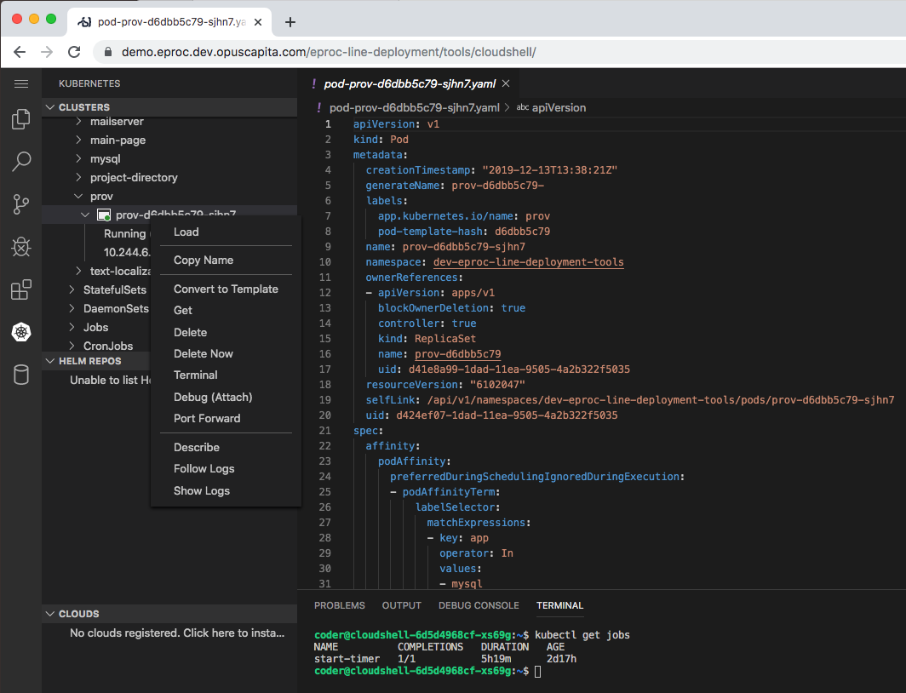

# minsk-core-cloud-shell

## Description

 [VS Code running on a remote server](https://github.com/cdr/code-server), accessible through the browser.

Initially we needed a possibility to improve user interaction with  [opuscapita/eproc-line-deployment](https://github.com/opuscapita/eproc-line-deployment) for colleagues who are not familiar with Kubernetes internals.

VS Code [Kubernetes plugin](https://github.com/Azure/vscode-kubernetes-tools) allows to see list of applications, their running status, logs, restart and scale applications.

Kubernetes API's RBAC allows to restrict possible iteraction scope to concrete Kubernetes namespace.

Additional tools like `kubectl` and `vim` are added to Docker image for advanced use-cases to users show familiar with these tools.
