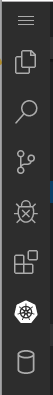
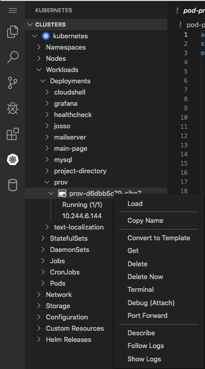

# minsk-core-cloud-shell

## Description

 [VS Code running on a remote server](https://github.com/cdr/code-server), accessible through the browser.

Initially we needed a possibility to improve user interaction with  [opuscapita/eproc-line-deployment](https://github.com/opuscapita/eproc-line-deployment) for colleagues who are not familiar with Kubernetes internals.

VS Code [Kubernetes plugin](https://github.com/Azure/vscode-kubernetes-tools) allows to see list of applications, their running status, logs, restart and scale applications.

Kubernetes API's RBAC allows to restrict possible iteraction scope to concrete Kubernetes namespace.

## Usage

### Terminal

Additional tools like `kubectl` and `vim` are added to Docker image for advanced use-cases to users show familiar with these tools.

To start new terminal session, use VS Code's default keybindings: 

- <kbd>Ctrl + Shift + c</kbd> for Windows and Linux.
- <kbd>CMD + Shift + c</kbd> for MacOS.

To open Command Palette:

- <kbd>Ctrl + Shift + p</kbd> for Windows and Linux.
- <kbd>CMD + Shift + p</kbd> for MacOS.

### Kubernetes

- Click to Kuberntes plugin icon in the sidebar.

- Use tree to navigate: `kubernetes (or another cluster name)` => `Workloads` => `Deployments` => `prov` (application deployment) => `prov-xxx-id` (application pod).
- Use mouse right click to call context menu and use available iteraction options.

- Use "Delete" item to restart application.
- Use "Teminal" item to execute application container terminal.
- Use "Follow Logs" item to see application logs.
